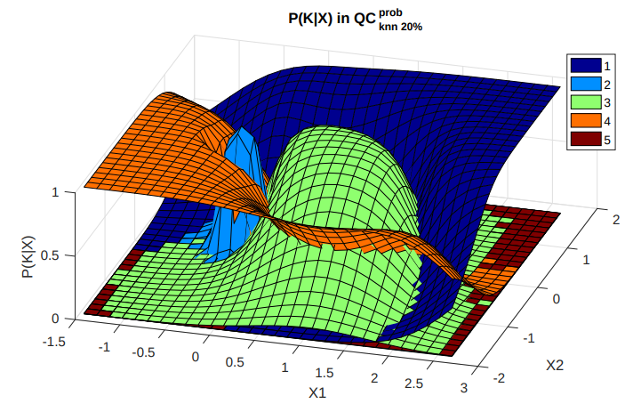

Clustering is quite new to the field of quantum computing but it may bring some interesting techniques worth testing out. Quantum clustering does not differ too much from the idea of finding blocks of data close to each other considering the dimensional space composed by the features. Therefore, we would need to find a good grouping strategy or proximity measure to evaluate the closeness between metrics.

## Probabilistic Quantum Clustering

This promising technique by [Castaña-Eslava et al.](https://arxiv.org/pdf/1902.05578.pdf) shows a quantum inspired approach able to find fuzzy membership regions based on quantum formalism. Similar to density based clustering the core idea is to be able to map a function $\psi$ so that it reveals the membership on a given sample.

<figure markdown>
  { width="500" }
  <figcaption>Membership function representation as wave functions</figcaption>
</figure>

On key parameter we will find when using this technique is the $\sigma$ variable defining our membership function (check the original paper for more details). This is also a common feature in many other implementations (ex. maximum number of clusters to detect on K-means or eps value on DBSCAN). Lucky for us if no $\sigma$ is defined the algorithm tries to find a initial estimator based on the density of the data points provided on its original feature space.

```py
label, proba = myproject.cluster(ctype="pqc")
```

There is plenty of room for improvement on this particular topic with implementations on purely quantum approaches in the following releases. As a reference take this work from the people at [Multiverse Computing](https://www.nature.com/articles/s41598-023-39771-6)
