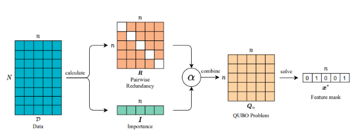
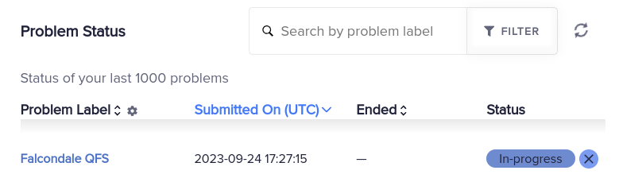

One of the key use cases for Quantum Computing over Classical resources is their capacity to explore the vast set of options that combinatorial optimization problems may pose. Feature Selection deals with finding a subset of the features in the original dataset so that by using a subset a more accurate model with better generalization capacities is obtained. Basically removes the noise or redundant information from the original dataset by removing specific features. It also benefits cases where certain features are hard to obtain because they might involve expensive or lengthy computation (examples can be from clinical analysis datasets when it comes to patient data, large historic datasets where one time features need to be found, etc.).

There are different techniques we may to obtain this subset but most of them require training models to check if the selection has been improved or not. This is the case for [Recursive Feature Elimination](https://scikit-learn.org/stable/modules/generated/sklearn.feature_selection.RFE.html). Others do it by simply removing data with [low variance](https://scikit-learn.org/stable/modules/generated/sklearn.feature_selection.VarianceThreshold.html#sklearn.feature_selection.VarianceThreshold). 

Quantum Computers do this differently. They focus on the informative capacity of the dataset. If a feature is good detecting a given label this has higher chances to remain; if two features show similarities in their behavior and provide similar prediction capacity over the target label then we may be able to suppress one of those. Therefore, we can encode our problem into a QUBO form and use a quantum computer to solve this combinatorial optimization problem. Quantum annealers among others are known to be good at this tasks.

<figure markdown>
  
  <figcaption>Feature selection mapped to a QUBO problem</figcaption>
</figure>

More in detail about the mathematical formulation involved can be found [in this work](https://arxiv.org/pdf/2203.13261.pdf).

The tricky thing comes when this QUBO formulation needs to be embedded into a quantum hardware. Instead of doing all this manually, Falcondale offers the ability to simply call:

```python
model.feature_selection(max_cols=3)
```

It will trigger a feature selection workflow targeting *survived* feature in above example for the Titanic dataset. By default, and if no additional information is provided, it will try to solve it using Simulated Annealing provided by DWave's neal package. If we think the problem is large enough or simulated annealing cannot provide the solution close to what we would like, we can select different modalities fot it to be solved, such as **simulated bifurcation**. Simulated bifurcation is a technique know to work even with large problems, such as a 2000 spin MAX-CUT problem as shown by the original work by [Goto et al.](https://www.science.org/doi/10.1126/sciadv.aav2372).

```python
model.feature_selection(max_cols=3, method="sb")
```
By default it uses the ballistic approach that should converge faster but might be prone to local minima instead of global solutions, as described in the original work by [Kanao et al.](https://www.nature.com/articles/s42005-022-00929-9). More options will be enabled in the future for heated and discrete SB.

The natural option to solve our QUBO formulation is to use a Quantum Annealing option, but this problem can also be tackled by digitized computers, mostly using variational techniques such as QAOA. One of the main challenges when approaching variational techniques is the challenge of simulation a complex evolution iterating over its parametrization. This is why quantum annealing is the _de facto_ method, as going for the variational approach could cause kernel to fail due to resource allocation for large datasets.

```python
model.feature_selection(max_cols=3, method="qaoa")
```

Hardware interaction is more complicated in this scenario and requires adapting the circuit to the specific quantum device and classical-quantum communication setup for hybrid workloads (Qiskit Runtime Service, Amazon Hybrid Jobs, etc...). But Quantum Annealing can be already shipped to hardware without much work and some providers already have us covered.

### Using DWave hardware

Quantum Hardware providers (such as D-Wave, Qiskit or even AWS) offer the option to connect to their service by means of an authentication TOKEN. Falcondale can redirect this connection so that actual hardware is used instead of locally simulated execution on one owns device..

In order to inform Falcondale of the connection to be used, one can introduce the TOKEN provided by the [Leap platform](https://cloud.dwavesys.com/leap/). 

<figure markdown>
  
  <figcaption>Access token inside DWave's Leap platform</figcaption>
</figure>

Copy and paste it into the working code as follows:

```py
myproject.feature_selection(max_cols=10, token="<YOUR DWAVE TOKEN>")
```

This way the process will be submitted to your user’s DWave account and solved using available machines.

<figure markdown>
  
  <figcaption>Falcondale submitted Quantum Feature Selection task</figcaption>
</figure>

For the moment DWave's low queuing time and easy to implement service enables this seamless integration with Falcondale. We are looking into the addition of other digitized annealing and variational techniques to be included so that they can also be submitted to IBM, Azure or AWS among others.